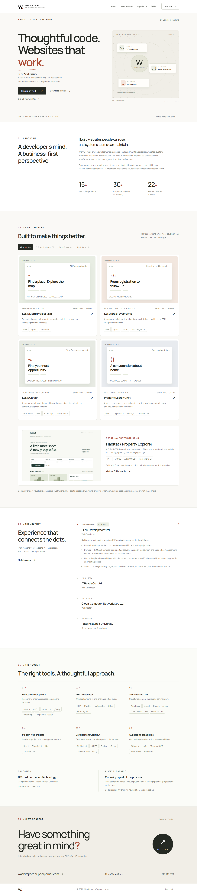

# Hi, I'm Watchiraporn 👋

**Web Developer | PHP • WordPress • MySQL • Responsive Web Applications**

Based in Bangkok, Thailand. I have 15+ years of experience working on corporate websites, CMS projects, and web applications. I enjoy turning business requirements into useful, maintainable web experiences.

[Download my resume](Watchiraporn-Suphachrunsap-Web-Developer.pdf)

## What I work on

- **Web development:** PHP, HTML, CSS, JavaScript, jQuery, Bootstrap.
- **CMS:** WordPress and Drupal, custom themes, content structures, and forms.
- **Backend:** MySQL, PostgreSQL, API integrations, and administrative interfaces.
- **Recent projects:** React, TypeScript, Node.js, and Tailwind CSS.
- **Workflow:** Git, Docker, and AI-assisted development with Codex.

## Portfolio projects

### [Personal Portfolio — PHP + Bootstrap](projects/portfolio-php/)

A responsive portfolio with project filters, project detail pages, a downloadable resume, and local frontend assets. The public-facing presentation summarizes professional experience; it does not include employer application source code.

### [Habitat — Property Explorer (demo)](projects/property-explorer-php/)

An independent PHP/MySQL demonstration with property search, filters, an illustrative map, and an authenticated CRUD back office. All records are fictional. Built with Codex assistance as a portfolio and learning project.

Each project includes setup instructions, screenshots, and verification notes. The PHP applications require PHP hosting to run; this repository provides their source code.

## About my professional work

My experience includes corporate and residential websites, campaign registration workflows, property discovery interfaces, and WordPress recruitment features. Employer code and customer data are not published here.

## ภาษาไทย

สวัสดีค่ะ ฉันชื่อ Watchiraporn ทำงานด้าน Web Development มากกว่า 15 ปี ถนัด PHP, WordPress, MySQL และการพัฒนาเว็บไซต์ที่ตอบโจทย์การทำงานจริง ใช้ GitHub นี้รวบรวมเดโมและอธิบายแนวคิดเบื้องหลังผลงาน โดยแยกงานเดโมออกจากประสบการณ์ Production ให้ชัดเจน

**Contact:** [wachiraporn.supha@gmail.com](mailto:wachiraporn.supha@gmail.com)

Profile: [github.com/BowwiiDev](https://github.com/BowwiiDev)
