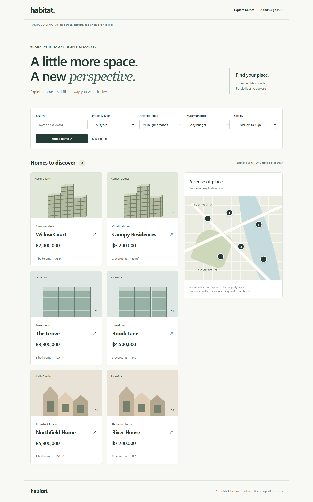

# Habitat - Property Explorer

A PHP/MySQL portfolio demonstration: searchable property listings, an illustrative map, and an authenticated administration interface.

**Independent demo built with Codex assistance.** All names, descriptions, prices, and locations are fictional. It contains no employer code or customer records. It is not a live real-estate service.



## Features

- Search by keyword, property type, neighborhood, and maximum price.
- Sort by price or newest entry; share the current filters through the URL.
- View property details and matching markers on an illustrative map.
- Administrator sign-in and POST-based sign-out.
- Create, edit, publish/unpublish, and delete properties with a confirmation page.
- Server-side validation, prepared SQL statements, HTML escaping, and CSRF tokens.
- Password hashing and session ID regeneration after sign-in.
- Responsive, keyboard-accessible pages; no JavaScript required.

## Stack

PHP 8.2+, MySQL 8 or MariaDB 10.4+, PDO MySQL, HTML, and CSS. No Composer or npm install is required. Tested locally with PHP 8.2.12 and MariaDB 10.4.32; use a supported, patched runtime when hosting publicly.

## Run locally

1. Start MySQL/MariaDB, for example through XAMPP.
2. Copy `config.example.php` to `config.local.php`, then set your database connection. Use a dedicated database. The default database name is `property_explorer_demo`.
3. In PowerShell, from this repository:

```powershell
# Replace with your own password (at least 12 characters).
$env:DEMO_ADMIN_PASSWORD = Read-Host 'New demo admin password'
php scripts/setup.php
Remove-Item Env:DEMO_ADMIN_PASSWORD
php -S 127.0.0.1:8081 -t public
```

With XAMPP, use `C:\xampp\php\php.exe` in place of `php` if PHP is not in PATH. `Read-Host` here displays typed characters; run this on your own local terminal.

4. Open **http://127.0.0.1:8081/**. Sign in with username **admin** and the password you set.

The setup command creates the database if allowed, creates two tables, and inserts six fictional properties. If your database user cannot create databases, create the configured database first. Setup refuses to reset an existing administrator or overwrite existing property records.

## Structure

```text
public/             Web root: pages, CSS, and original SVG asset
src/bootstrap.php   Database, session, validation, search, and layout helpers
scripts/setup.php   CLI-only schema and demo setup
tests/              Repeatable validation checks
docs/               Screenshots and design decisions
config.example.php  Configuration template without real credentials
```

Set the web server document root to **public/**. This keeps configuration and CLI files outside the served directory. Do not deploy the whole repository as a public document root.

## Validate

```powershell
php tests/validation.php
```

The validation checks do not need a database. Browser checks performed for this version are recorded in `docs/VERIFICATION.md`.

## Design choices

- Server-rendered pages and GET filters keep navigation usable without JavaScript.
- PDO prepared statements separate values from SQL. Sort columns come from a fixed allowlist.
- The map uses percentage positions to stay responsive; it is not a geospatial system.
- Draft properties are hidden from public results and detail routes.
- Deletion requires authentication, a confirmation page, a POST request, and a CSRF token.

## Limitations

This is a small, single-administrator portfolio demo. Search returns up to 100 records; pagination, file uploads, inquiries, email delivery, and CRM connections are intentionally outside its scope. Login throttling is session-scoped and is not sufficient for an internet-facing authentication service. Public hosting would need shared rate limiting, operational monitoring, backup/recovery, and an appropriate server configuration.

## ภาษาไทย

เดโมนี้ใช้ฝึกอธิบายการทำงานของ PHP/MySQL ตั้งแต่ค้นหาข้อมูลจนถึงระบบ CRUD หลังบ้าน เขียนใหม่สำหรับ Portfolio ด้วยความช่วยเหลือของ Codex และใช้ข้อมูลสมมติทั้งหมด ดูคำอธิบายสำหรับสัมภาษณ์ใน `docs/INTERVIEW-TH.md`

## Attribution

Created for [BowwiiDev](https://github.com/BowwiiDev). HTML/CSS illustrations are original to this demonstration. No proprietary company source code is included.
